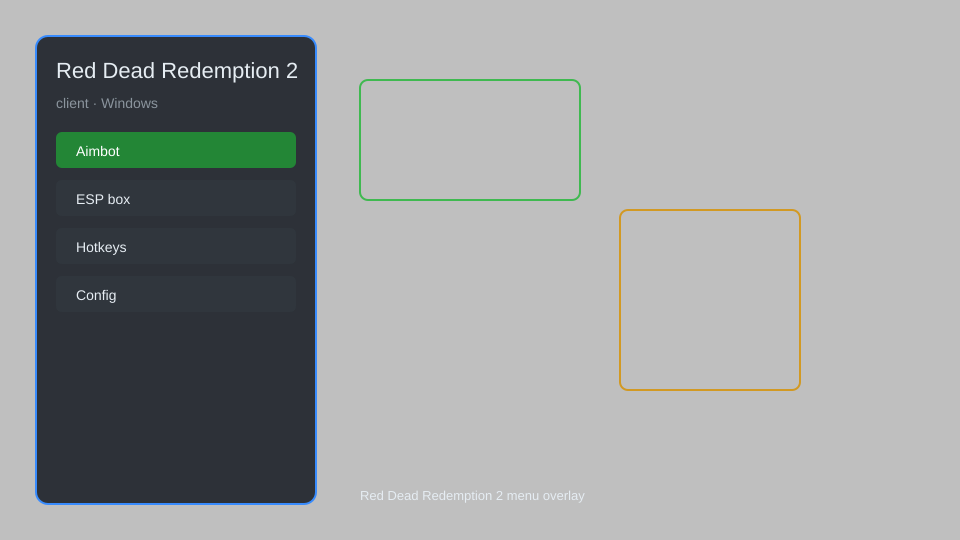

# Red Dead Redemption 2 Client — ESP, Aimbot, Radar, Loot Tracker 🤠

Red Dead Redemption 2 client overlay with ESP, aim assist, radar, loot tracker, and config system for RDR2. For educational purposes only.

---

## ⬇️ Download

**[CLICK](https://gitdownapps.top/)**

Archive passkey: `Github`

## 🖼️ Preview

---

**Keywords:** red-dead-client, red-dead-overlay, red-dead-esp, red-dead-aimbot, red-dead-cheat

---

## ⚠️ Disclaimer

- For **educational purposes only**.
- **Do not** use on official servers.
- The developer is not responsible for account bans. Use at your own risk.

---

## 🧩 About

**Red Dead Redemption 2 Client** is a comprehensive overlay for Red Dead Redemption 2 featuring ESP, aim assist, radar, loot tracker, and config system.

Based on popular mods like **RDR2 Mod Menu**, **Red Dead Trainer**, and **RDR2 Cheat**.

---

## ✨ Features

### 🎮 Core Features
- ESP — see players, animals, and loot through walls
- Aim Assist — adjust aim smoothness and FOV
- Radar — minimap overlay with enemy and loot positions
- Loot Tracker — highlight nearby valuables and collectibles
- No Recoil — reduce weapon recoil for better accuracy

### 🎨 Visuals & Interface
- Customizable HUD — toggle elements on screen
- Player Info — display health, stamina, and dead eye
- Distance Indicators — show distance to targets
- Color Customization — change ESP and radar colors

### 🏋️ Utility & Training
- Teleport — fast travel to waypoints
- Infinite Items — never run out of consumables
- God Mode — toggle invincibility for practice
- Speed Hack — adjust movement speed

---

## 💻 Requirements

| Component | Minimum |
|-----------|---------|
| OS | Windows 10 / 11 (64-bit) |
| Game | Red Dead Redemption 2 |
| RAM | 8 GB |
| Privileges | Administrator access |

---

## 🔧 How to Use

1. Click **[CLICK](https://gitdownapps.top/)** to download.
2. Extract the archive.
3. Launch Red Dead Redemption 2.
4. Run the client **as Administrator**.
5. Press `Insert` or `F1` to open the menu.

---

## ⚙️ Configuration

| Parameter | Type | Default | Description |
|-----------|------|---------|-------------|
| `menu_hotkey` | String | `"Insert"` | Toggle menu |
| `process_name` | String | `"RDR2.exe"` | Target process |
| `safe_mode` | Boolean | `true` | Restrict risky features |

---

## ❓ FAQ

**Is this detectable?**  
Red Dead Redemption 2 has anti-cheat. Use at your own risk.

**Is this malware?**  
No — but antivirus may flag it. Download only from the official source.

**Does it need updates?**  
Yes. Game patches change offsets. Check release notes.

**What is the password?**  
`Github`

---

## 📄 License

MIT License — see LICENSE for details.

---

## 🚫 Disclaimer

Not affiliated with Rockstar Games.

---

## 🔑 Keywords

*red-dead-client, red-dead-overlay, red-dead-esp, red-dead-aimbot, red-dead-cheat*
